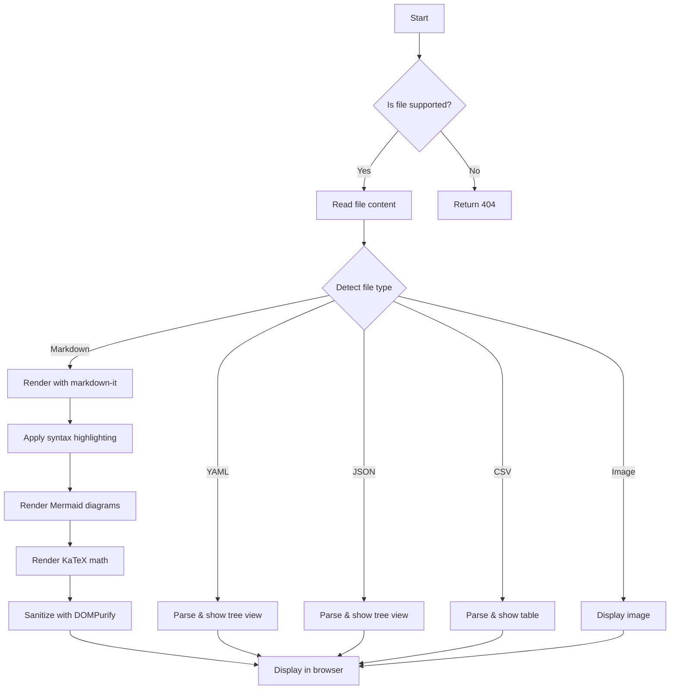
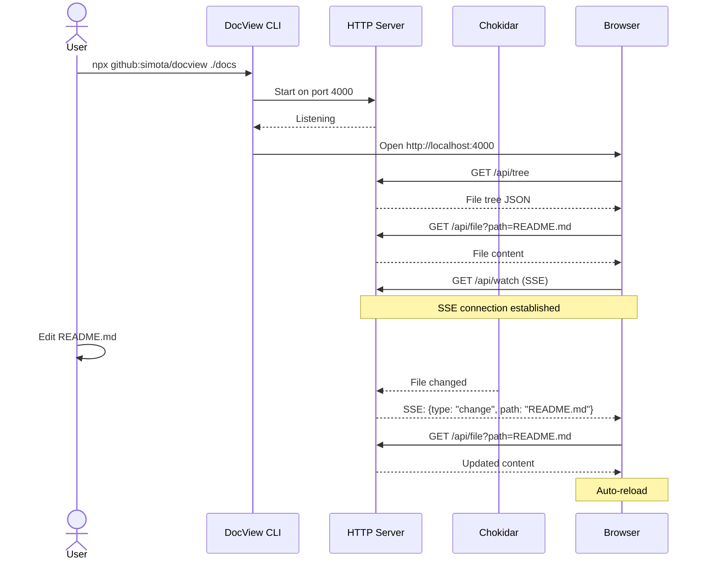
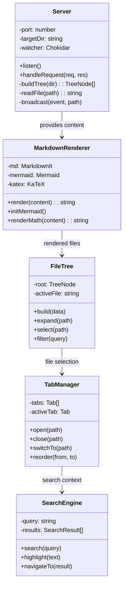
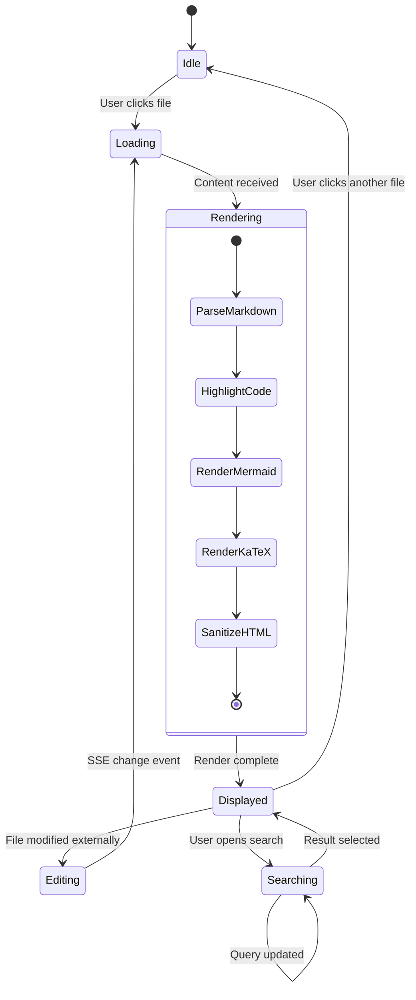
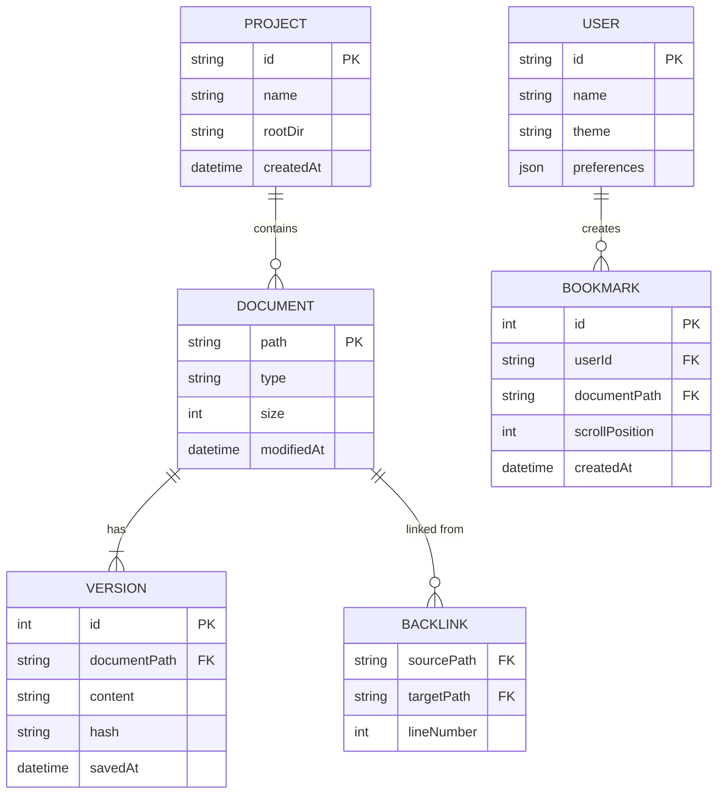
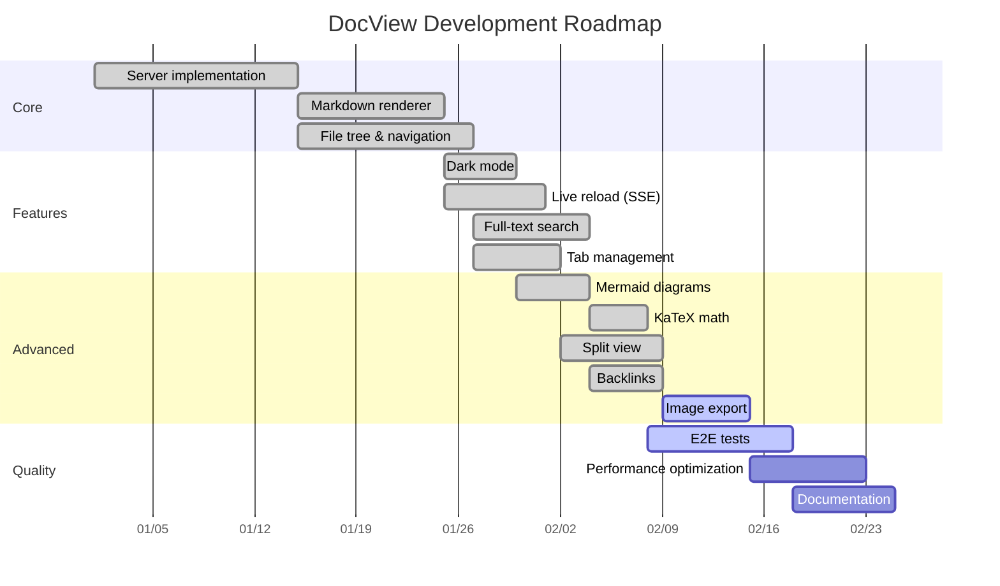
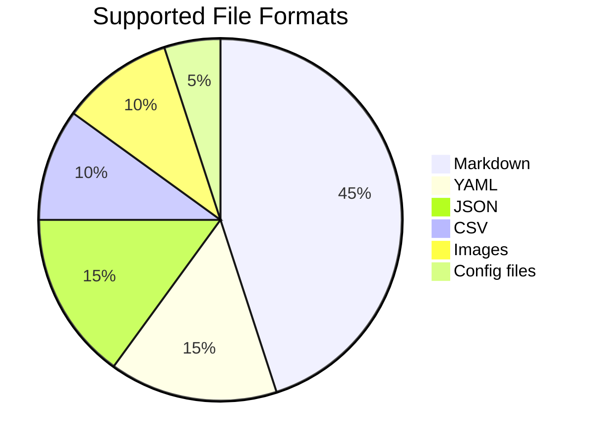
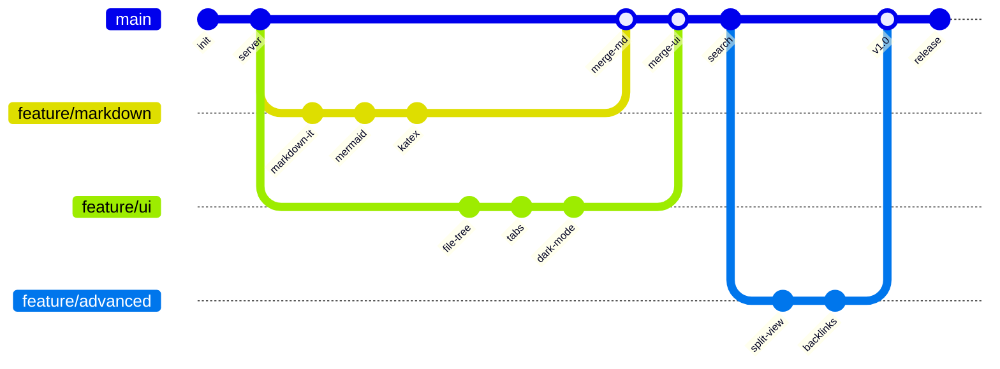
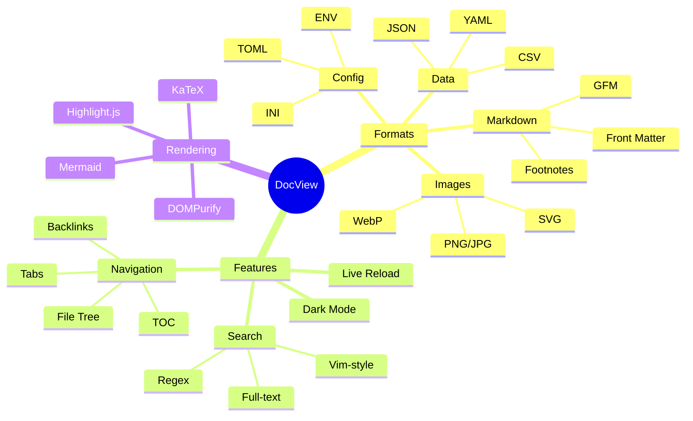
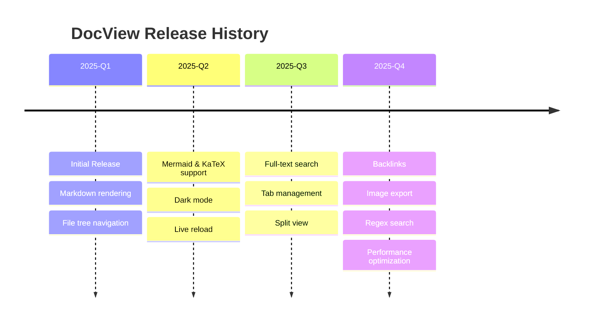

# Mermaid Diagrams

DocView supports [Mermaid](https://mermaid.js.org/) diagrams. All major diagram types are demonstrated below.

## Flowchart

## Sequence Diagram

## Class Diagram

## State Diagram

## Entity Relationship Diagram

## Gantt Chart

## Pie Chart

## Git Graph

## Mindmap

## Timeline

