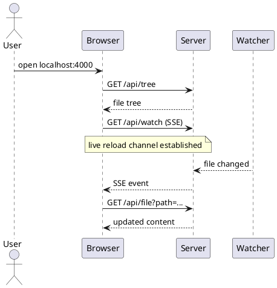
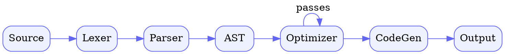
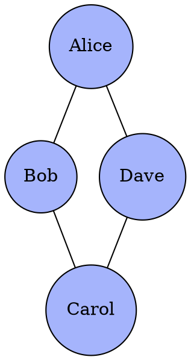

# External Diagrams

In addition to [Mermaid](./diagrams.md), DocView supports 10 diagram formats rendered via a local CLI (when available) or [Kroki](https://kroki.io) as a fallback. Each rendered diagram exposes a floating toolbar (hover to reveal) with: **zoom in / zoom out / fit / copy source / download SVG / download PNG / fullscreen**.

> **Tip:** `Ctrl` (or `Cmd`) + mouse wheel zooms inline. Drag pans when zoomed in. Double-click toggles 1x ↔ 2x.

## PlantUML

A widely used UML notation. Falls back from the local `plantuml` CLI to Kroki.



## D2

Modern, terraform-inspired diagram language. Uses local `d2` CLI if installed.

```d2
direction: right
user: User { shape: person }
client: Browser
server: HTTP Server
fs: Filesystem { shape: cylinder }

user -> client: navigate
client -> server: GET /api/file
server -> fs: read
fs -> server: bytes
server -> client: response
```

## Graphviz (DOT)

The classic graph-rendering language. Local `dot` CLI is preferred when available.



The `dot` language tag is accepted as an alias:



## Ditaa

ASCII art → polished raster-style diagrams.

```ditaa
+--------+   +--------+   +--------+
|  cBLU  |   |        |   |  cGRE  |
|  User  +-->|  App   +-->|   DB   |
|        |   |        |   |        |
+--------+   +---+----+   +--------+
                 |
                 v
            +----+----+
            |  cYEL   |
            |  Cache  |
            +---------+
```

## nomnoml

Lightweight UML rendered from a custom text DSL.

```nomnoml
[<frame>Renderer pipeline|
  [Markdown] -> [<abstract>Tokenizer|markdown-it]
  [<abstract>Tokenizer] -> [HTML]
  [HTML] -> [DOMPurify]
  [DOMPurify] -> [<note>safe HTML]
]
```

## WaveDrom

Digital timing diagrams from a JSON DSL — popular in hardware design.

```wavedrom
{ signal: [
  { name: "clk",   wave: "p.....|..." },
  { name: "data",  wave: "x.345x|=.x", data: ["A", "B", "C", "D"] },
  { name: "valid", wave: "0.1..0|1.0" },
  {},
  { name: "ack",   wave: "0..1.0|0.." }
],
  head: { text: "Simple bus handshake" },
  config: { hscale: 1 }
}
```

## Pikchr

A compact, PIC-inspired diagram language (the engine behind SQLite docs).

```pikchr
boxht = 0.4
boxwid = 0.9
arrowht = 0.1

box "Markdown"; arrow right
box "markdown-it" "parser"
arrow right
box "DOMPurify" "sanitizer"
arrow right
box "Browser"
```

## Svgbob

Treats ASCII art as input and produces clean hand-drawn SVG.

```svgbob
       .--> [Markdown]
      /         |
[Source]        v
      \    [markdown-it]
       \        |
        \       v
         '->[HTML]
              |
              v
         [DOMPurify] ----> [Viewer]
```

## BPMN

Business Process Model and Notation (BPMN 2.0 XML). Typically authored in a BPMN editor; pasted XML renders directly.

```bpmn
<?xml version="1.0" encoding="UTF-8"?>
<bpmn:definitions xmlns:bpmn="http://www.omg.org/spec/BPMN/20100524/MODEL"
                  xmlns:bpmndi="http://www.omg.org/spec/BPMN/20100524/DI"
                  xmlns:dc="http://www.omg.org/spec/DD/20100524/DC"
                  xmlns:di="http://www.omg.org/spec/DD/20100524/DI"
                  id="Definitions_1" targetNamespace="http://example.com/bpmn">
  <bpmn:process id="Process_1" isExecutable="false">
    <bpmn:startEvent id="Start" name="Start"/>
    <bpmn:task id="Task" name="Do work"/>
    <bpmn:endEvent id="End" name="Done"/>
    <bpmn:sequenceFlow id="f1" sourceRef="Start" targetRef="Task"/>
    <bpmn:sequenceFlow id="f2" sourceRef="Task" targetRef="End"/>
  </bpmn:process>
  <bpmndi:BPMNDiagram id="BPMNDiagram_1">
    <bpmndi:BPMNPlane id="BPMNPlane_1" bpmnElement="Process_1">
      <bpmndi:BPMNShape id="Start_di" bpmnElement="Start">
        <dc:Bounds x="80" y="100" width="36" height="36"/>
      </bpmndi:BPMNShape>
      <bpmndi:BPMNShape id="Task_di" bpmnElement="Task">
        <dc:Bounds x="180" y="78" width="100" height="80"/>
      </bpmndi:BPMNShape>
      <bpmndi:BPMNShape id="End_di" bpmnElement="End">
        <dc:Bounds x="340" y="100" width="36" height="36"/>
      </bpmndi:BPMNShape>
      <bpmndi:BPMNEdge id="f1_di" bpmnElement="f1">
        <di:waypoint x="116" y="118"/>
        <di:waypoint x="180" y="118"/>
      </bpmndi:BPMNEdge>
      <bpmndi:BPMNEdge id="f2_di" bpmnElement="f2">
        <di:waypoint x="280" y="118"/>
        <di:waypoint x="340" y="118"/>
      </bpmndi:BPMNEdge>
    </bpmndi:BPMNPlane>
  </bpmndi:BPMNDiagram>
</bpmn:definitions>
```

## Excalidraw

Hand-drawn whiteboard sketches. Export a drawing from [excalidraw.com](https://excalidraw.com) as `.excalidraw` JSON and paste:

```excalidraw
{
  "type": "excalidraw",
  "version": 2,
  "source": "https://excalidraw.com",
  "elements": [
    {
      "id": "rect1",
      "type": "rectangle",
      "x": 100, "y": 100, "width": 220, "height": 100,
      "angle": 0, "strokeColor": "#1e1e1e", "backgroundColor": "#a5d8ff",
      "fillStyle": "solid", "strokeWidth": 2, "strokeStyle": "solid",
      "roughness": 1, "opacity": 100, "groupIds": [], "frameId": null,
      "roundness": { "type": 3 }, "seed": 1, "version": 1, "versionNonce": 1,
      "isDeleted": false, "boundElements": [], "updated": 1, "link": null, "locked": false
    },
    {
      "id": "text1",
      "type": "text",
      "x": 140, "y": 135, "width": 140, "height": 30, "angle": 0,
      "strokeColor": "#1e1e1e", "backgroundColor": "transparent",
      "fillStyle": "solid", "strokeWidth": 1, "strokeStyle": "solid",
      "roughness": 1, "opacity": 100, "groupIds": [], "frameId": null,
      "roundness": null, "seed": 2, "version": 1, "versionNonce": 2,
      "isDeleted": false, "boundElements": [], "updated": 1, "link": null, "locked": false,
      "text": "Hello DocView", "fontSize": 20, "fontFamily": 1,
      "textAlign": "center", "verticalAlign": "middle",
      "baseline": 22, "containerId": null, "originalText": "Hello DocView"
    }
  ],
  "appState": { "viewBackgroundColor": "#ffffff" },
  "files": {}
}
```

## How it works

Each `\`\`\`type` code block is intercepted, posted to `/api/diagram`, and rendered to SVG. The server first tries a matching local CLI (`d2`, `plantuml`, `dot` for graphviz). If none is installed, it falls back to [kroki.io](https://kroki.io). Override with `KROKI_URL=http://localhost:8000` to self-host.

| Lang tag | Format | Local CLI | Kroki fallback |
|----------|--------|-----------|----------------|
| `plantuml` | PlantUML | `plantuml` | ✓ |
| `d2` | D2 | `d2` | ✓ |
| `graphviz`, `dot` | Graphviz | `dot` | ✓ |
| `ditaa` | Ditaa | — | ✓ |
| `nomnoml` | nomnoml | — | ✓ |
| `wavedrom` | WaveDrom | — | ✓ |
| `pikchr` | Pikchr | — | ✓ |
| `svgbob` | Svgbob | — | ✓ |
| `bpmn` | BPMN | — | ✓ |
| `excalidraw` | Excalidraw | — | ✓ |
